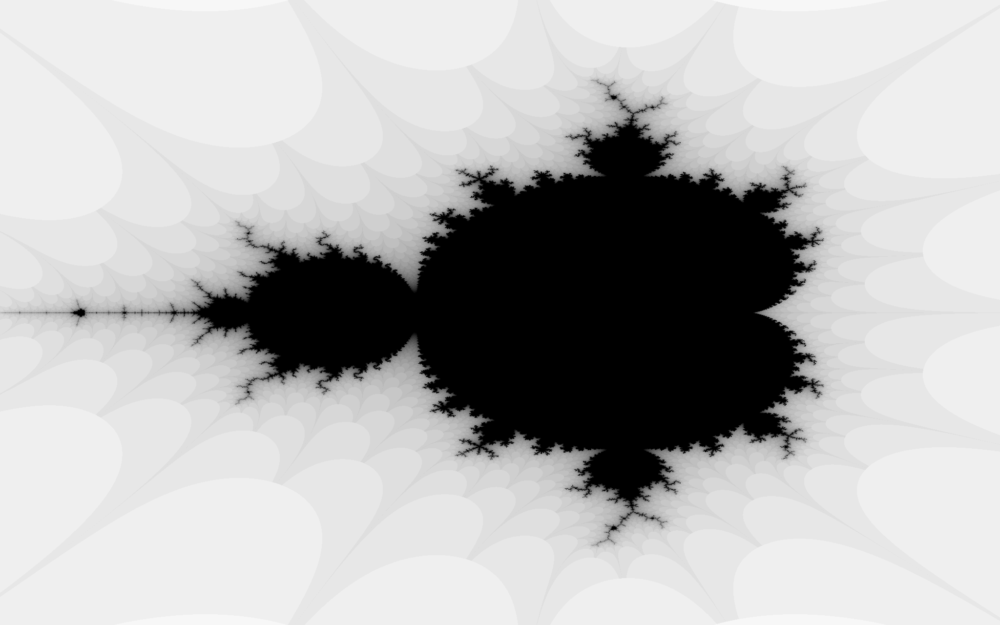

# stlab Experiments

Playing with the [stlab concurrency library](http://stlab.cc/concurrency/2017/05/11/concurrency.html).
These currently (September 2017) require the [develop branch](https://github.com/stlab/libraries/tree/develop)
of stlab.

## Mandelbrot Set

This experiment uses stlab's `async` and `Future` features to calculate
the Mandelbrot set in separate tasks for each rectangular tile of an image.

* Code: [mandelbrot_example.cpp](mandelbrot_example.cpp)